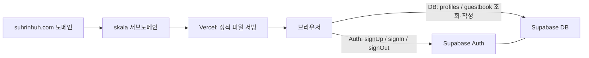
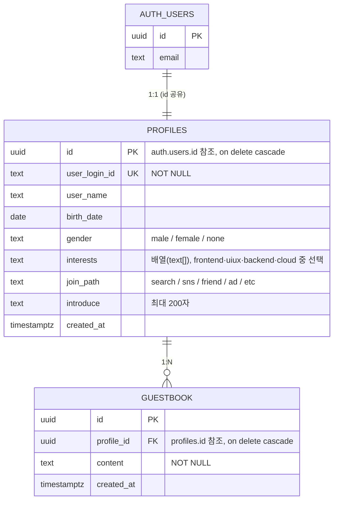

# SKALA-FRONT

SKALA 4기 1주차(2026.07.15 ~ 07.16) 'HTML, CSS, JavaScript' 학습 과제로 제작한 개인 포트폴리오 겸 방명록 사이트입니다.
배포된 서비스로 별도의 실행 과정 없이 참여 가능합니다.

[](https://skala.suhrinhuh.com)

## 🎯 프로젝트 개요

- 자기소개, 여행 기록, 강의 일정, 미니게임 등을 담은 개인 포트폴리오와, 로그인한 사용자가 글을 남길 수 있는 방명록 기능을 함께 제공하는 사이트입니다.
- 프레임워크나 번들러 없이 순수 HTML/CSS/JS 정적 파일로만 구성하였습니다 (Vite 등 빌드 스텝 없음).
- 서브도메인(`skala.suhrinhuh.com`)을 생성하여 Vercel에 정적 파일을 그대로 배포합니다.
- 디자인은 따뜻한 크림색 배경에 그래프 그리드를 깔고, 테라코타 계열 accent 컬러와 픽셀풍 한글 폰트(NeoDunggeunmo) + Space Grotesk 조합을 사용한 "인덱스 카드" 느낌의 에디토리얼 스타일입니다. 그림자나 둥근 모서리 없이 1px 테두리로 플랫하게 구성하였으며, 우표 스탬프·CD 플레이어 같은 레트로 소품을 포인트로 사용하였습니다.

## 🏗️ 아키텍처 및 기술 스택



| 구분     | 사용 기술                                                    |
| -------- | ------------------------------------------------------------ |
| Frontend | HTML5, CSS3, Vanilla JavaScript (ES Modules, Web Components) |
| Backend  | Supabase (Auth, Postgres, RLS)                               |
| Deploy   | Vercel (정적 파일 서빙, 커스텀 서브도메인)                   |
| 외부 API | Open-Meteo(날씨), jsdelivr CDN (`@supabase/supabase-js`)     |
| 폰트     | Google Fonts (Space Grotesk), NeoDunggeunmo (jsdelivr CDN)   |

Vercel은 빌드 없이 정적 파일을 그대로 서빙하며, 브라우저는 `@supabase/supabase-js`를 통해 Supabase Auth/DB와 직접 통신합니다. 데이터 접근 제어는 Supabase의 RLS 정책이 담당합니다.

### ERD



## 페이지별 기능

| 페이지            | 경로                 | 주요 기능                       |
| ----------------- | -------------------- | ------------------------------- |
| index.html        | `/`                  | 히어로, 방명록, 미니게임 3종    |
| login.html        | `/login.html`        | 이메일/비밀번호 로그인          |
| signUp.html       | `/signUp.html`       | 3단계 회원가입, 가입완료 모달   |
| signUpResult.html | `/signUpResult.html` | 가입 완료 안내 및 바로가기      |
| myClass.html      | `/myClass.html`      | 주간 시간표, 과목별 TODO        |
| myHoliday.html    | `/myHoliday.html`    | 하루 일과 타임라인              |
| myProfile.html    | `/myProfile.html`    | 자기소개, 프로젝트, 스킬        |
| myTrip.html       | `/myTrip.html`       | 여행 기록 캐러셀, 음악 플레이어 |

### 페이지 상세 설명

- **index.html** — 히어로 섹션과 다른 페이지를 홍보하는 뉴스 캐러셀(`<news-carousel>`), 로그인한 사용자가 글을 남길 수 있는 방명록(`<guestbook-panel>`), 세계지도 위 도시 핀을 클릭하면 현재 시각과 Open-Meteo 날씨를 보여주는 위젯, Up & Down 숫자 맞추기·성적 계산기·내 가방 속 보기 미니게임 3종을 모아둔 메인 허브 페이지입니다. 방명록은 비로그인 상태에서 작성을 시도하면 로그인 안내 모달을 띄웁니다.
- **login.html** — 이메일 아이디 입력 필드와 도메인 select(직접 입력 포함)를 조합해 이메일을 구성하고, 비밀번호와 함께 `signIn()`을 호출합니다. 로그인 성공 시 `index.html`로 이동하며, 하단에 `signUp.html`로 가는 링크를 제공합니다.
- **signUp.html** — 계정 정보 → 프로필 정보 → 자기소개 순서의 3단계 슬라이드 폼으로 구성되며, 상단 스텝 바로 진행 상태를 표시합니다. 이전/다음/초기화 버튼을 제공하고, 초기화 시 확인 모달을, 제출 성공 시 가입완료 스탬프 모달을 띄웁니다. 제출 시 입력값을 모아 `signUp()`을 호출하며, 완료 후 `signUpResult.html`로 이동합니다. 이미 로그인된 상태라면 `getCurrentUser()`로 감지해 `index.html`로 자동 리다이렉트합니다.
- **signUpResult.html** — 가입 완료를 알리는 안내 문구와 유의사항 목록을 보여주고, `index.html`/`myProfile.html`/`myClass.html`/`myHoliday.html` 등 다른 페이지로 바로 이동할 수 있는 링크 목록을 제공합니다. 페이지 전용 스크립트 없이 공통 컴포넌트만 사용합니다.
- **myClass.html** — 월~금 시간대별 시간표 그리드를 보여주며, 클릭 가능한 셀을 선택하면 `<todo-modal>` 컴포넌트가 열려 해당 과목의 체크리스트형 TODO 목록을 표시합니다.
- **myHoliday.html** — 하늘·도시 풍경 레이어와 해/달 전환 애니메이션이 있는 파노라마 씬 위에, 하루 일과를 8단계로 나눈 타임라인 도트를 배치합니다. 도트를 클릭하면 해당 시점의 메모와 하늘 상태(시간대)가 함께 전환됩니다.
- **myProfile.html** — 인트로 히어로와 ABOUT 패널, `<skills-panel>` 컴포넌트로 표시되는 스킬 게이지 바, 태그가 달린 프로젝트 4건을 소개하는 PROJECTS 그리드, 좋아하는 음식·2026년 목표를 담은 PERSONAL 섹션으로 구성됩니다. 스크롤에 따라 요소가 나타나는 리빌 애니메이션과 이메일 주소 복사 버튼도 포함합니다.
- **myTrip.html** — `<travel-album>` 컴포넌트가 여행 에피소드와 사진을 플립카드 형태로 넘겨보는 캐러셀을 제공하고, `<music-player>` 컴포넌트가 CD 플레이어 모양의 플로팅 사이드바에서 배경음악을 재생/일시정지합니다.

## 📁 폴더 구조

```text
skala-front/
├── README.md
├── vercel.json
├── css/
│   └── style.css              # 전역 스타일시트 (공통 토큰 + 페이지별 섹션)
├── html/
│   ├── index.html
│   ├── login.html
│   ├── myClass.html
│   ├── myHoliday.html
│   ├── myProfile.html
│   ├── myTrip.html
│   ├── signUp.html
│   └── signUpResult.html
├── media/
│   ├── audio.mp3
│   ├── video.mp4
│   └── (여행지 사진, 미니게임 썸네일 등 이미지)
├── script/
│   ├── bag.js
│   ├── components.js          # site-header / site-footer
│   ├── grade.js
│   ├── guestbook.js           # guestbook-panel
│   ├── holiday.js
│   ├── musicPlayer.js         # music-player
│   ├── newsCarousel.js        # news-carousel
│   ├── realtimeInfo.js
│   ├── skillsPanel.js         # skills-panel
│   ├── todoModal.js           # todo-modal
│   ├── travelAlbum.js         # travel-album
│   ├── upDown.js
│   └── weatherAPI.js
└── supabase/
    └── action.js               # Supabase 통신 전용 모듈
```

## 🚀 로컬 실행 방법

1. 저장소를 클론합니다.

```bash
git clone https://github.com/<계정명>/skala-front.git
```

2. 프로젝트 폴더로 이동합니다.

```bash
cd skala-front
```

3. 별도의 빌드 과정이 없으므로 정적 서버로 바로 실행합니다 (`npx serve` 예시).

```bash
npx serve .
```

4. 브라우저에서 안내된 주소(예: `http://localhost:3000/html/index.html`)로 접속합니다. VSCode를 사용하는 경우 Live Server 확장으로 `html/index.html`을 열어도 동일하게 동작합니다.

## 환경 설정 (Supabase)

이 프로젝트는 별도의 번들러나 `.env` 처리 없이 정적 파일만으로 배포되기 때문에, Supabase 접속 정보를 `/supabase/action.js` 파일에 상수로 직접 기입하는 구조를 사용합니다.
